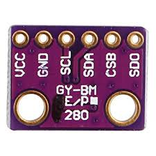

# Arduino BMP280 library

**Author: unknown**  
**Arduino C Application**  
**IDE/structure: VSCode + PlatformIO**  

## DESCRIPTION

Arduino BMP280 (temperature, pressure, altitude) sensor library.

## USAGE

Make sure to set the correct I2C or SPI values (addresses, etc.).  
Run it and check serial monitor.  

## CHANGELOG

## BACKLOG
